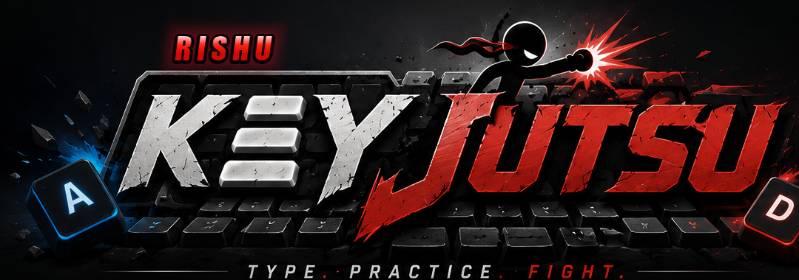
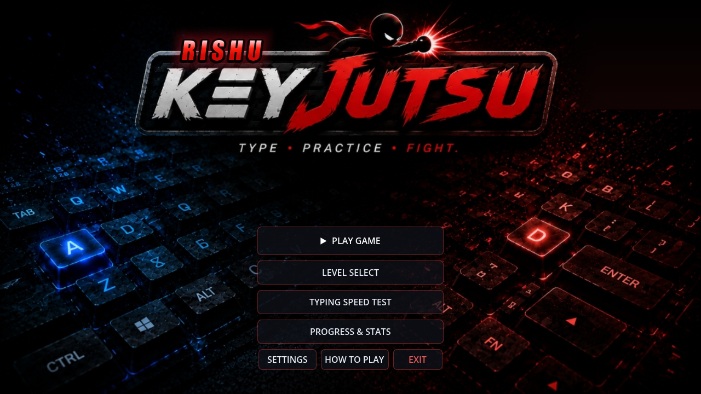
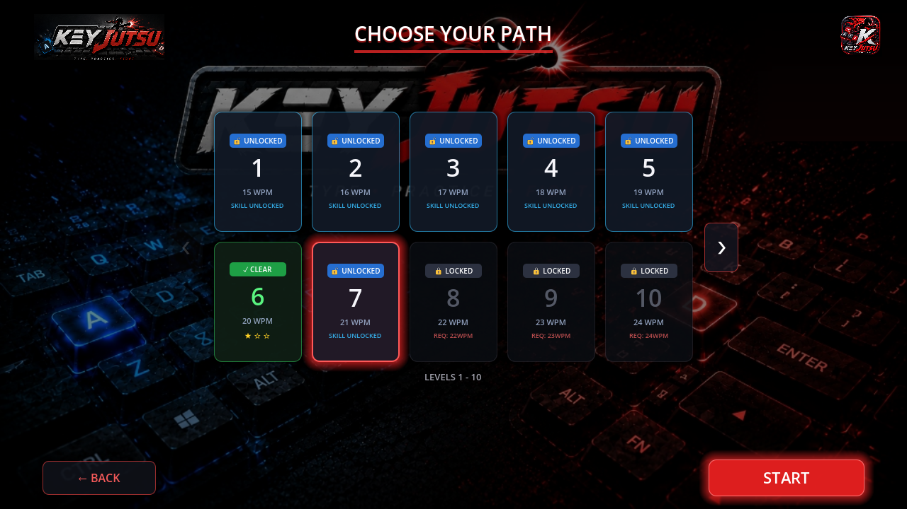
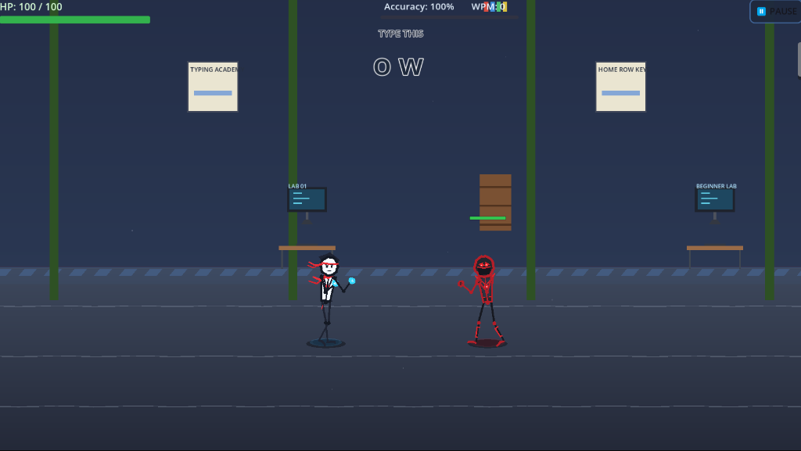
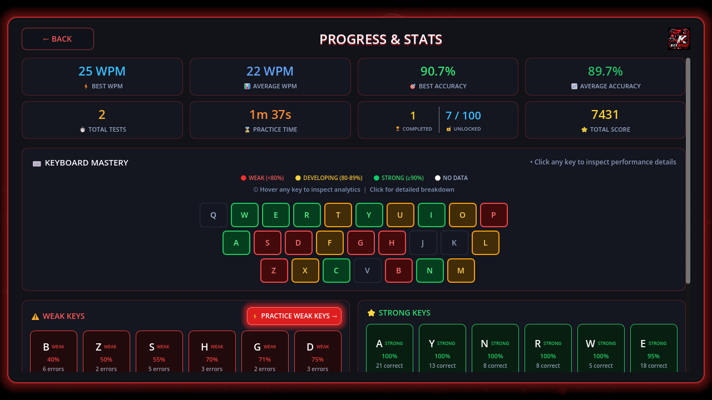

<p align="center">
  
</p>

<h1 align="center">Rishu Key Jutsu — Martial Arts Touch Typing Combat</h1>

<p align="center">
  <strong>Execute real-time martial arts strikes through touch typing precision across 100 levels and 11 cyber-dojo arenas.</strong>
</p>

<p align="center">
  <a href="https://keyjutsu-game.vercel.app/play.html"></a>
  <a href="https://keyjutsu-game.vercel.app/download.html"></a>
  
  
</p>

---

## 🥋 About The Game

**Rishu Key Jutsu** transforms raw touch typing speed, accuracy, and keystroke consistency into high-octane martial arts fighting mechanics in real time.

Every accurate letter triggers swift punches, crescent kicks, and multi-hit combo chains. Typos break your rhythm, leaving your shinobi open to counter-attacks. Conquer 100 progressively challenging levels, unlock 11 dynamic arenas, and defeat menacing bosses to claim the title of **S-Rank Supreme Grandmaster**.

---

## ✨ Key Features

- **🥋 Stylized Shinobi Martial Artists**: Fully articulated 60 FPS combatants rendered on HTML5 Canvas with procedural physics for flowing twin headband ribbons and battle gear.
- **🗺️ 100 Progressive Difficulty Levels**: Speed targets scale from 15 WPM in early Dojo training up to 148 WPM at the Level 100 Grandmaster Summit.
- **🏯 11 Cyber & Dojo Arenas**: Training Dojo, Keyboard Circuit, Neon Rooftop, Underground Facility, Emerald Meadow, Coastal Fortress, Bamboo Jungle, Frozen Pass, Celestial Realm, and Final Key Summit.
- **👹 Multi-Phase Boss Battles**: Imposing Samurai Kabuto bosses with berserk transformations, glowing crimson auras, and special attack intervals.
- **⚡ Chakra Jutsu Unleashed**: Chain 15+ accurate keystrokes to activate Chakra Rage, dealing massive damage and restoring player HP.
- **📊 7-Tier Ninja Rank Evaluation**: Dynamic rank evaluation based on the official formula: `40% WPM + 40% Accuracy + 20% Consistency` (Ranks: F, E, D, C, B, A, S).
- **📈 Typing Analytics Dashboard**: Track key-by-key accuracy streaks, practice time, weak key error patterns, and high scores.
- **📦 1-Click Windows Desktop Setup**: Bundled into a native 14.7 MB Windows installer (compiled with Inno Setup) with automatic desktop icon and start menu integration.
- **🔒 100% Offline & Private**: Zero external dependencies, zero ads, zero telemetry, and zero microtransactions.

---

## 🕹️ Live Web Demo & Desktop Download

- **⚔️ Play in Browser**: [https://keyjutsu-game.vercel.app/play.html](https://keyjutsu-game.vercel.app/play.html)
- **🌐 Official Website**: [https://keyjutsu-game.vercel.app/](https://keyjutsu-game.vercel.app/)
- **⬇️ Download Windows Setup (.EXE)**: [https://keyjutsu-game.vercel.app/downloads/RishuKeyJutsuSetup.exe](https://keyjutsu-game.vercel.app/downloads/RishuKeyJutsuSetup.exe) (14.7 MB)
- **📦 Portable ZIP Archive**: [https://keyjutsu-game.vercel.app/downloads/Rishu-KeyJutsu-Windows-v1.0.0.zip](https://keyjutsu-game.vercel.app/downloads/Rishu-KeyJutsu-Windows-v1.0.0.zip) (14.8 MB)

---

## 🛠️ Tech Stack & Architecture

| Layer | Technology | Purpose |
| :--- | :--- | :--- |
| **Rendering Engine** | HTML5 Canvas 2D (`requestAnimationFrame`) | 60 FPS procedural character animation, hitboxes, and particle FX |
| **Game Logic** | JavaScript (ES6+ Vanilla) | State management, combat delta-timing, typo penalties, boss AI |
| **Audio Engine** | Web Audio API / HTML5 Audio | Low-latency martial arts punch, kick, and special jutsu sound effects |
| **Styling & HUD** | CSS3 (Custom Variables, Glassmorphism) | Dark cyberpunk tactical aesthetic, responsive arcade layouts |
| **Desktop Launcher** | C# (.NET Framework) | Win32 COM `IShellLinkW` desktop shortcut integration and borderless app execution |
| **Installer** | Inno Setup 6 (LZMA2 Ultra Compression) | 1-Click native Windows desktop packaging |
| **Deployment** | Vercel | Global CDN delivery and production CI/CD |

---

## 🚀 How to Run Locally

### 1. Clone or Download Repository
```bash
git clone https://github.com/rishabhyadav47383/rishu-key-jutsu.git
cd rishu-key-jutsu
```

### 2. Launch Local Server
You can use any static server, Python, or Node.js:

```bash
# Using Python
python -m http.server 8080

# Or using Node.js (npx serve)
npx serve .
```

Open `http://localhost:8080/play.html` in your browser.

---

## 📸 Screenshots

<p align="center">
  
  
</p>

<p align="center">
  
  
</p>

---

## 👤 Author & Developer

**Code With Rishabh (Rishabh Yadav)**
- **GitHub**: [@rishabhyadav47383](https://github.com/rishabhyadav47383)
- **Instagram**: [@rishabh__yadav777](https://www.instagram.com/rishabh__yadav777?stkn=MWpncXM0MWV3OXd1cw==)
- **Email**: [ysrishabh017@gmail.com](mailto:ysrishabh017@gmail.com)

---

## 📄 License

This project is freely distributed for personal use and learning. Developed with ❤️ by **Rishabh Yadav**.
